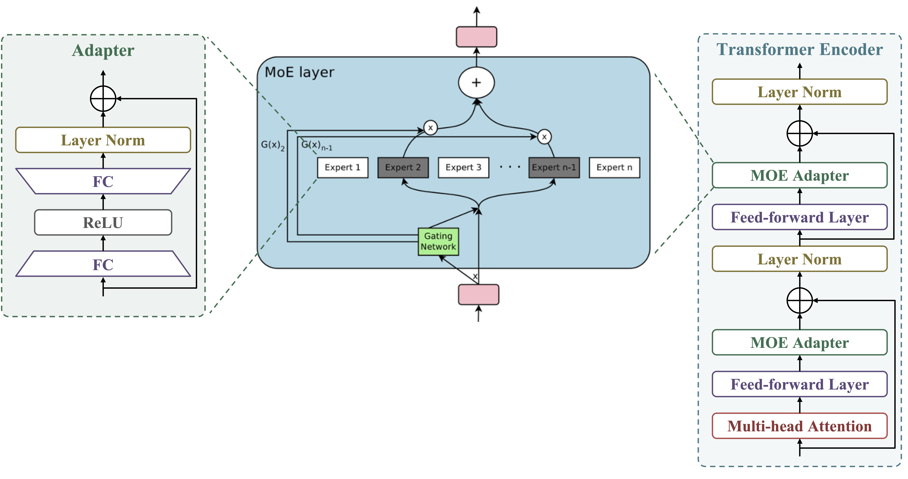

# Adapter and Mixture-of-Experts (MoE) in Transformer Encoders

We insert adapters into the Transformer encoder layers to extract fine-grained representations through fine-tuning. Suppose each encoder layer contains two fully connected feed-forward networks (FFN). We place an adapter right after each FFN. Let the hidden representation output from the FFN be $h$. Each adapter module first normalizes $h$ via Layer Normalization (LN) and then applies a two-layer fully connected network with ReLU activation. Formally, a **single** adapter can be written as:

$$
z = \text{LN}(h),
$$

$$
h^{\prime} = h + W_2 \,\sigma\bigl(W_1\, z + b_1\bigr) + b_2,
$$

where $\sigma(\cdot)$ denotes the ReLU function, $W_1$ and $W_2$ are learnable weight matrices, and $b_1$ and $b_2$ are bias terms. The residual connection $h + (\cdot)$ ensures stable training and effective gradient flow. The dimension of the hidden layer inside the adapter is set to 256, while the main model parameters remain frozen during fine-tuning.

---

## Mixture-of-Experts (MoE)

To further enhance the model’s capacity to capture various speaker-relevant factors at different layers, we introduce a Mixture-of-Experts (MoE) strategy within each adapter position. Instead of having a **single** adapter, we define $K$ parallel “experts” (i.e., multiple adapters), each of which can specialize in different aspects of speech representation. Let 

$$
\mathrm{Adapter}_k(h), \quad k = 1, 2, \dots, K
$$

denote the transformation of the $k$-th expert. We then employ a gating mechanism $g(h)$ that computes an expert selection probability for each $\mathrm{Adapter}_k$. One common gating function is a softmax over expert scores:

$$
g_k(h) = \frac{\exp\Bigl(\bigl(w_k^g\bigr)^\top h\Bigr)}
{\sum_{j=1}^K \exp\Bigl(\bigl(w_j^g\bigr)^\top h\Bigr)},
$$

where $w_k^g$ is a learnable parameter vector for the $k$-th expert’s gating score. The output of the MoE-based adapter can then be written as a weighted sum of all experts:

$$
z = \text{LN}(h),
$$

$$
o = \sum_{k=1}^{K} g_k(z) \,\mathrm{Adapter}_k\bigl(z\bigr),
$$

$$
h^{\prime} = h + o.
$$

Here, each expert $\mathrm{Adapter}_k(\cdot)$ internally follows the same two-layer feed-forward design (with possibly different parameters) as in Equations (1)--(2), but they are *separately* learned. The final output $h^{\prime}$ incorporates the specialized transformations from all experts, weighted by the data-dependent gating mechanism.

